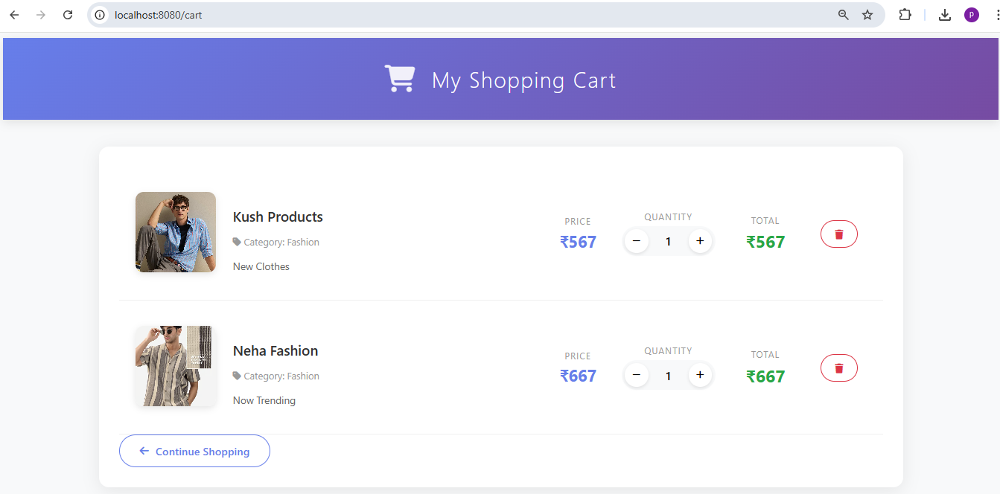
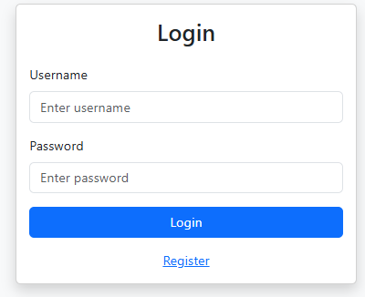

# 🛒 Spring Boot E-Commerce Web Application (Thymeleaf)

A full-stack E-Commerce Web Application similar to Amazon, built using Spring Boot and Thymeleaf.  
This project demonstrates backend development, authentication, database integration, and dynamic UI rendering.

---

## 🚀 Tech Stack

- Java 17
- Spring Boot
- Spring Security
- Thymeleaf
- Spring Data JPA (Hibernate)
- MySQL
- Maven

---

## ✨ Features

### 👤 User Features
- User Registration & Login
- Secure Authentication using Spring Security
- Browse Products
- View Product Details
- Add to Cart
- Remove from Cart
- Place Orders

### 🛠 Admin Features
- Add Products
- Update Products
- Delete Products
- Manage Inventory

---

## 📂 Project Structure

com.example.ShopingWeb
│
├── controller
├── service
├── repository
├── entity
├── config
└── templates


---

## 📸 UI Screenshots

- Home Page
 
- Product Listing Page

- Cart Page

- Login & Registration Page


- Admin Dashboard


---

## ⚙️ Installation & Setup

### 1️⃣ Clone the repository

```bash
git clone https://github.com/manish01-star/spring-boot-shopping-web


## 🗄 Database Setup

1. Import the database using MySQL:

```bash
mysql -u root -p < database/shoppingdb.sql

2. Update application.properties with your MySQL username 

spring.datasource.url=jdbc:mysql://localhost:3306/shoppingdb
spring.datasource.username=root
spring.datasource.password=
spring.jpa.hibernate.ddl-auto=update


